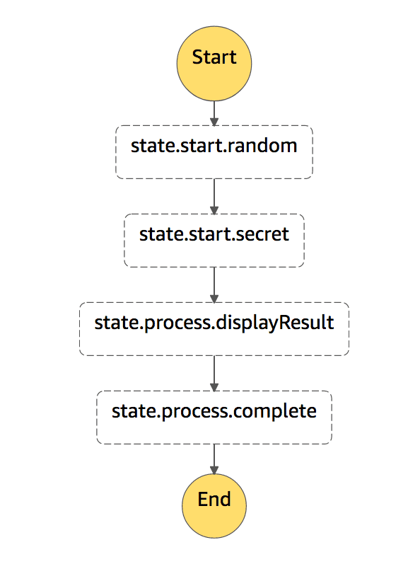

# AWS Step Functions Random Demonstration

This example is to demonstrate how we can handle microservice failure and retry using AWS Step Functions. Given the fact that endpoints may fail, this allows us to build resiliency when calling API’s. 

The step function will fail 50% of the time at the state.start.random task, but you can demonstrate how the step function still succeeds eventually. The second step is simply anything else, in this case, just getting a credential from secrets manager, feel free to use whatever you like here.

1. Create a lambda function using the code in random.py (Python 3.8).
1. Create a lambda function using the code in seekret.py (Python 3.8).
1. Copy the ARN’s for your lambda functions.
1. Create a new step function using the random-bn.json file.
1. Replace the lambda ARN’s.
1. Test (you will not need to pass through a payload, it’s not expecting anything).

